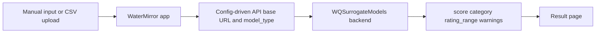

# WaterMirror

[](LICENSE) [](https://expo.dev) [](https://github.com/KageRyo/WaterMirror/actions/workflows/ci.yml)

Project Summary
---------------
WaterMirror is the frontend mobile client for `WQSurrogateModels`. It collects current water indicator values, sends them to the backend assessment API, and displays WQI5-based assessment results.

Supported Indicators
--------------------
- Dissolved oxygen (DO)
- Biochemical oxygen demand (BOD)
- Suspended solids (SS)
- Ammonia nitrogen (NH3-N)
- Electrical conductivity (EC)

Requirements
------------
- Node.js 16+ or 18+
- npm 8+ or yarn 1/3
- Expo CLI (`npx expo`) for local run

Quickstart
----------
```bash
git clone https://github.com/KageRyo/WaterMirror.git
cd WaterMirror
npm install
```

Create `.env` from the example:
```bash
cp .env.example .env
```

Start the app:
```bash
npx expo start
```

Example `.env`:
```dotenv
EXPO_PUBLIC_API_BASE_URL=http://localhost:8010
EXPO_PUBLIC_DEFAULT_MODEL=direct_wqi5
EXPO_PUBLIC_REQUEST_TIMEOUT_MS=10000
```

Deployment
----------
- For local development, run on simulator/emulator via Expo.
- For production, follow Expo's published app workflow.

Android Build Notes
-------------------
- Keep Android app configuration in `app.json` consistent with Expo schema.
- Do not place Android permission fields inside `adaptiveIcon`; malformed Android config can lead to unstable release builds.
- Prefer validating release configuration with `npx expo-doctor` before EAS builds.
- `eas.json` now provides:
  - `preview` profile for APK testing
  - `production` profile for AAB generation

Suggested Android verification flow:

```bash
npm test
npx expo-doctor
npx expo start --clear
eas build -p android --profile preview
```

If a preview APK still crashes on launch, capture the device log with `adb logcat` before changing UI code.

Backend Integration
-------------------
WaterMirror is the frontend for `WQSurrogateModels`. All API calls are centralized in `src/utils/apiClient.js`.

The app primarily uses the modern v2 endpoints under `/api/v2/*`:

- `GET /api/v2/health` — connection / health check
- `POST /api/v2/assessment` — single record assessment
- `POST /api/v2/assessment/csv/summary` — CSV batch upload (returns mean score)
- `GET /api/v2/percentile` — get score percentile
- `GET /api/v2/categories` — get WQI5 category distribution

The backend also keeps the old root-level endpoints (`/status`, `/predict`, `/score/total/`, ...) for backward compatibility. These are marked as deprecated and new development should prefer the `/api/v2/*` paths.

Example `.env` (pointing to service root, not including `/api/v2`):

```dotenv
EXPO_PUBLIC_API_BASE_URL=http://localhost:8010
EXPO_PUBLIC_DEFAULT_MODEL=direct_wqi5
EXPO_PUBLIC_REQUEST_TIMEOUT_MS=10000
```

Flow:

`Input water indicators or CSV -> apiClient -> WQSurrogateModels (v2) -> Display result`

Architecture
------------


Result Page Behavior
--------------------
- WaterMirror does not derive WQI5 category thresholds locally.
- The app displays backend-returned `category`, `rating_range`, and `warnings`.
- Missing stored report data falls back to an alert instead of navigating into a crashing result path.

CSV upload format
-----------------
The accepted format is CSV with a header row containing columns:
`DO,BOD,NH3N,EC,SS`

Example row:
`7.2,3.1,0.5,280,45`

Permissions
-----------
- File system access for upload
- Network access for backend communication

Project Structure
-----------------
- `src/`: application source code
  - `utils/apiClient.js` — centralized client for all `/api/v2/*` calls
- `assets/`: static assets and images
- `.env.example`: runtime configuration example
- `tests/`: Node-based helper tests

Contributing
------------
1. Fork repository
2. Create feature branch
3. Add tests/manual test notes
4. Open pull request

License
-------
Apache License 2.0. See `LICENSE`.
