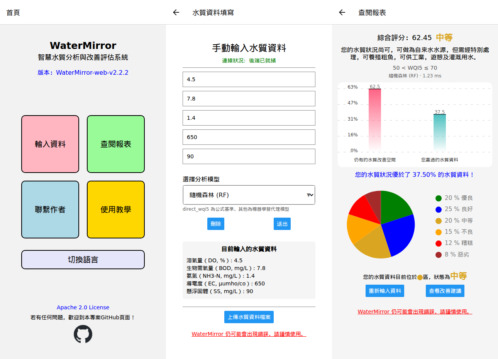
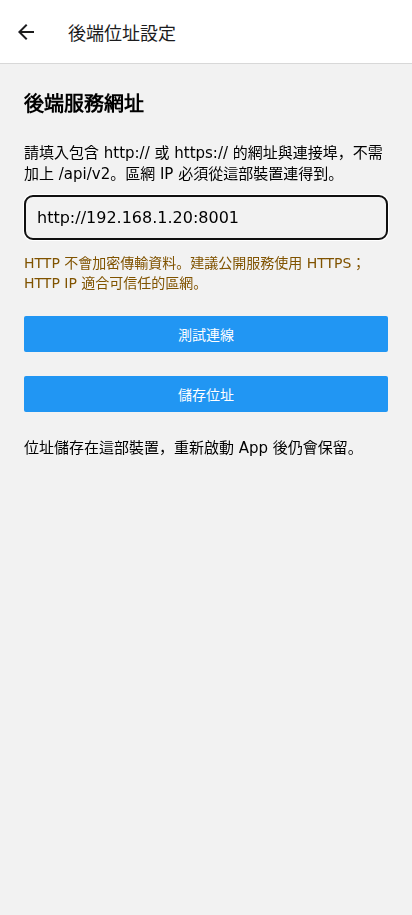

# WaterMirror

[](LICENSE) [](https://expo.dev) [](app.json) [](https://github.com/KageRyo/WaterMirror/releases/latest/download/WaterMirror.apk) [](https://github.com/KageRyo/WaterMirror/actions/workflows/ci.yml)

WaterMirror is a cross-platform mobile frontend for WQI5-based current-state water quality assessment.

<p align="center">
  
</p>

<p align="center"><sub>Sample measurements and assessment results are simulated locally.</sub></p>

It allows users to:

- input five water quality indicators manually
- upload CSV files
- submit data to the [WQSurrogateModels](https://github.com/KageRyo/WQSurrogateModels) backend
- display backend-returned WQI5 score, category, rating range, and warnings

WaterMirror does not calculate WQI5 thresholds locally. The backend is the source of truth for assessment logic.

## Relationship with the Companion Repository

This project is part of a two-repository system:

- `WaterMirror`: cross-platform mobile frontend for data entry, CSV upload, and result visualization
- [WQSurrogateModels](https://github.com/KageRyo/WQSurrogateModels): FastAPI backend and model/reproducibility repository for WQI5-based current-state water quality assessment

WaterMirror depends on the API contract exposed by [WQSurrogateModels](https://github.com/KageRyo/WQSurrogateModels) under `/api/v2/*`.

## Supported Indicators

- Dissolved oxygen (`DO`)
- Biochemical oxygen demand (`BOD`)
- Ammonia nitrogen (`NH3N`)
- Electrical conductivity (`EC`)
- Suspended solids (`SS`)

## Prerequisites

- Node.js >= 20.19
- npm
- A running [WQSurrogateModels](https://github.com/KageRyo/WQSurrogateModels) backend for live assessments

WaterMirror uses Node.js/npm and Expo. The companion Python backend may use `uv`, but `uv` is not used to run this frontend.

## Quickstart

```bash
git clone https://github.com/KageRyo/WaterMirror.git
cd WaterMirror
npm ci
cp .env.example .env
npx expo start
```

## Environment Configuration

In the app, open **Backend settings** from the home screen to enter your own
backend URL, test its health and readiness, and save it on the device. For a
LAN server, include the protocol and port: `http://192.168.1.20:8001`. Public
APKs support HTTP IP addresses; HTTPS is recommended for public services.
The saved address overrides the initial build-time URL and survives restarts.
Release builds without a default URL prompt for configuration before data entry.



The screenshot uses an example LAN address; it does not identify a public service.

Set `EXPO_PUBLIC_API_BASE_URL` to the backend service root. Do not include `/api/v2`.

### Local backend on the same machine

```dotenv
EXPO_PUBLIC_API_BASE_URL=http://localhost:8001
EXPO_PUBLIC_DEFAULT_MODEL=direct_wqi5
EXPO_PUBLIC_REQUEST_TIMEOUT_MS=10000
```

### Physical phone testing on the same LAN

```dotenv
EXPO_PUBLIC_API_BASE_URL=http://<your-lan-ip>:8001
EXPO_PUBLIC_DEFAULT_MODEL=direct_wqi5
EXPO_PUBLIC_REQUEST_TIMEOUT_MS=10000
```

### Remote backend

```dotenv
EXPO_PUBLIC_API_BASE_URL=https://api.example.com
EXPO_PUBLIC_DEFAULT_MODEL=direct_wqi5
EXPO_PUBLIC_REQUEST_TIMEOUT_MS=10000
```

## Backend Contract

WaterMirror uses `src/utils/apiClient.js` as the centralized client for the backend.

Primary endpoints:

- `GET /api/v2/health`
- `POST /api/v2/assessment`
- `POST /api/v2/assessment/csv/summary`
- `GET /api/v2/percentile`
- `GET /api/v2/categories`

Legacy root-level endpoints remain available on the backend for backward compatibility, but new development should use `/api/v2/*`.

## CSV Format

Accepted CSV files must contain this header row:

```text
DO,BOD,NH3N,EC,SS
```

Example row:

```text
7.2,3.1,0.5,280,45
```

## Documentation

- [Backend Integration](docs/backend-integration.md)
- [CSV Format](docs/csv-format.md)
- [Result Fields](docs/result-fields.md)
- [API Migration](docs/api-migration.md)
- [Demo Flow](docs/demo-flow.md)
- [Android Build](docs/android-build.md)
- [Mobile Identity and Network Security](docs/mobile-security.md)
- [Release Process](docs/release-process.md)
- [Troubleshooting](docs/troubleshooting.md)
- Backend API/model docs: <https://github.com/KageRyo/WQSurrogateModels>

## Project Structure

- `src/`: application source code
- `assets/`: static assets and images
- `docs/`: integration, build, and troubleshooting guides
- `.env.example`: runtime configuration example
- `tests/`: Node-based helper tests

## License

Apache License 2.0. See `LICENSE`.
